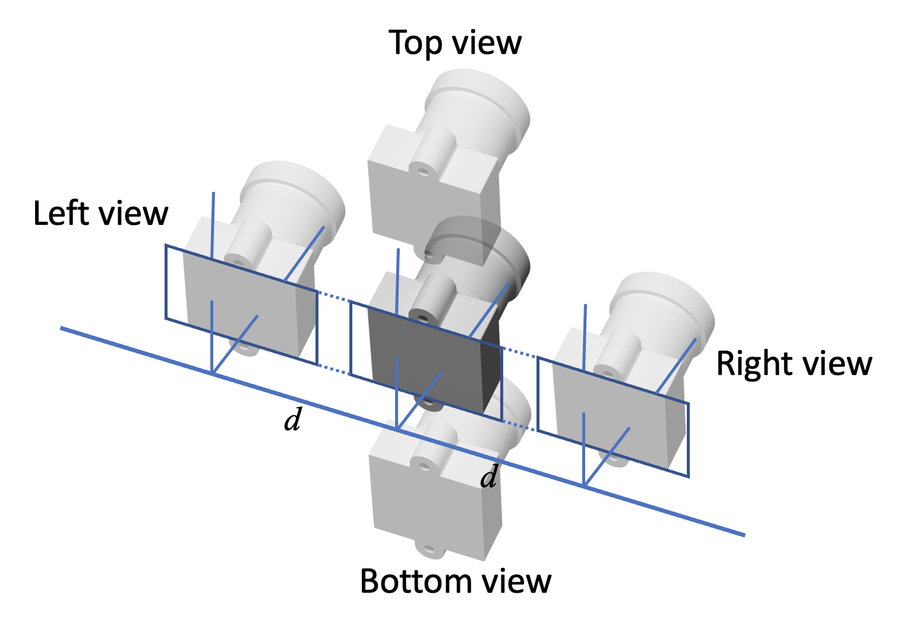

# Self-supervised Multiscopic Vision Matching

This is the official implementation code for SMVmatching -- "Stereo Matching by Self-supervision of Multiscopic Vision". For technical details, please refer to :

**Stereo Matching by Self-supervision of Multiscopic Vision** <br />
[Weihao Yuan](https://weihao-yuan.com), Yazhan Zhang, Bingkun Wu, Siyu Zhu, Ping Tan, Michael Yu Wang, Qifeng Chen <br />
**IROS2021** <br />
**[[Paper](https://arxiv.org/pdf/2104.04170.pdf)] [[Project Page](https://sites.google.com/view/multiscopic)]** <br />



### Bibtex
If you find this code useful, please consider citing:

```
@inproceedings{yuan2021stereo,
  title={Stereo Matching by Self-supervision of Multiscopic Vision},
  author={Yuan, Weihao and Zhang, Yazhan and Wu, Bingkun and Zhu, Siyu and Tan, Ping and Wang, Michael Yu and Chen, Qifeng},
  booktitle={Proceedings of the IEEE/RSJ International Conference on Intelligent Robots and Systems (IROS)},
  pages={},
  year={2021},
  organization={IEEE}
}
```

## Contents
1. [Environment Setup](#environment-setup)
2. [Dataset](#dataset)
3. [Training](#training)

## Environment setup

**Dependencies**:

- Python2.7
- PyTorch (0.4.0+)
- torchvision (0.2.0+)

## Datasets:
The synthetic datasets are available at [here](https://www.google.com/url?q=https%3A%2F%2Fhkustconnect-my.sharepoint.com%2F%3Af%3A%2Fg%2Fpersonal%2Fwyuanaa_connect_ust_hk%2FEnaJ9tiz4pVBvY6FTgJRq0sB6M_NAT6qqIZYRTO1YZa2xg%3Fe%3DAhbY15&sa=D&sntz=1&usg=AFQjCNHL_uNo_yMwz8iFqzNWoydlZs64bw). It should be organized as follows for the training:
```
dataset/
    TRAIN/
        SyntheData/
            000001/
                view0.png
                view1.png
                view2.png
    TEST/
    EVAL/

```


## Training:
```
. run.sh
```

### Pretrained models

[Model](https://hkustconnect-my.sharepoint.com/:u:/g/personal/wyuanaa_connect_ust_hk/EV8ZiijFyL5PqS9lRZ5wEccBbrUL83oToGl0Aab0Sbo4Lw?e=oNhyxq)

Results on KITTI 2015:

| <sub> Dataset </sub> | <sub>D1-all</sub> | <sub>D1-noc</sub> | <sub>D1-occ</sub> |
|:-----------:|:----------:|:----------:|:------------:|
| <sub> Train set </sub> | <sub>3.82%</sub> | <sub>3.69%</sub> | <sub>10.87%</sub> |
| <sub> Online Test set </sub> | <sub>4.43%</sub> | <sub>4.20%</sub> | <sub>-</sub> |

---

## Acknowledgements
Thanks to Jia-Ren Chang et al. for opening source of their excellent work [PSMNet](https://github.com/JiaRenChang/PSMNet).

## License
Licensed under an MIT license.